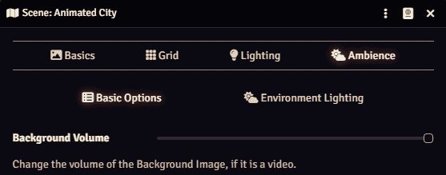

# Background Volume

This mod allows the DM to configure the volume of a scene's background in Foundry VTT.

The final background volume is controlled by both the ambient slider and the scene's settings.

## How to set the background volume as the DM

1. Open the scene configuration menu.
2. Adjust the "Background Volume" slider under the **Ambience and Atmosphere** heading.
3. Click save.

## How to Install

### Module Browser

Background Volume is now in the Foundry VTT module browser! Click on the `install` button to install the latest version.

### Latest Manifest

Add this module using this manifest link: https://raw.githubusercontent.com/mtvjr/background-volume/master/module.json

### Install a previous versions

Manifest links are available in the releases sections for releases after 1.0.2.

## I have a problem, how do I get in contact?

Please ping mtvjr#4598 on [Foundry's Discord](https://discordapp.com/invite/DDBZUDf) in the #modules-troubleshooting channel or open up an issue on GitHub.
